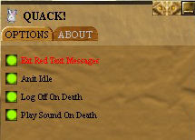

# Quack
A [Decal](http://www.decaldev.com/) utility plugin for use with private Asheron's Call emulation servers

<picture>
 <source media="(prefers-color-scheme: dark)" srcset="Quack.jpg">
 <source media="(prefers-color-scheme: light)" srcset="Quack.jpg">
 
</picture>

# Features include:

* Anti Client idle
* Logout on death
* Play sound on death
* Squelch red client status messages

# Installing

See the [Releases](https://github.com/FtuoilXelrash/Releases) for the latest release. 

Install as you normally would for any Decal plugin distributed as a DLL.

last release 10/01/2008 Version 2.9.0

# Prerequisites
[Decal](http://www.decaldev.com/) 

[ACEmulator](http://emulator.ac/)

# Here are some places to visit:
* one
* two

  

# Contact
- Creator
[Ftuoil Xelrash Discord Channel](https://discord.gg/G8mfZH2TMp)

# Disclaimer
Asheron's Call was a registered trademark of Turbine, Inc. and WB Games Inc which has since expired.

ACEmulator is not associated or affiliated in any way with Turbine, Inc. or WB Games Inc.
